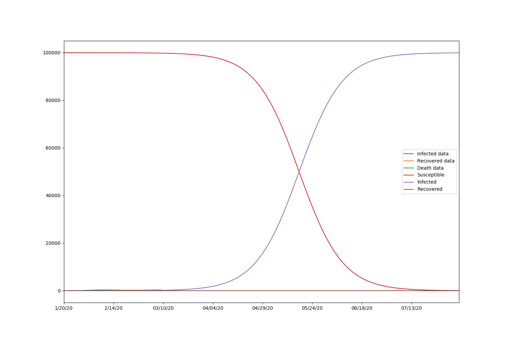
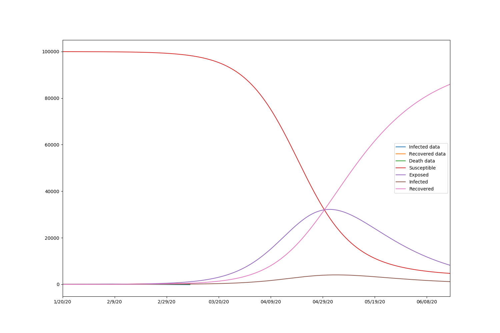

# Spread of Covid-19: Estimation and Simulation

<h1>Table of Contents</h1>

<ul class="toc-item"><li><a href="#Introduction" data-toc-modified-id="Introduction-1">1&nbsp;&nbsp;Introduction</a></li><li><a href="#Literature-Review" data-toc-modified-id="Literature-Review-2">2&nbsp;&nbsp;Literature Review</a></li><li><a href="#Deterministic-Model-for-Disease-Spreading" data-toc-modified-id="Deterministic-Model-for-Disease-Spreading-3">3&nbsp;&nbsp;Deterministic Model for Disease Spreading</a><ul class="toc-item"><li><a href="#SIR-model" data-toc-modified-id="SIR-model-3.1">3.1&nbsp;&nbsp;SIR model</a></li><li><a href="#SEIR-model" data-toc-modified-id="SEIR-model-3.2">3.2&nbsp;&nbsp;SEIR model</a></li></ul></li><li><a href="#Disease-Spreading-on-Network" data-toc-modified-id="Disease-Spreading-on-Network-4">4&nbsp;&nbsp;Disease Spreading on Network</a><ul class="toc-item"><li><a href="#Considering-Transmissibility-for-Outbreak-Analysis" data-toc-modified-id="Considering-Transmissibility-for-Outbreak-Analysis-4.1">4.1&nbsp;&nbsp;Considering Transmissibility for Outbreak Analysis</a></li><li><a href="#Scale-free-Network" data-toc-modified-id="Scale-free-Network-4.2">4.2&nbsp;&nbsp;Scale-free Network</a></li></ul></li><li><a href="#Experiments" data-toc-modified-id="Experiments-5">5&nbsp;&nbsp;Experiments</a><ul class="toc-item"><li><a href="#Deterministic-Model-based-on-Real-Data" data-toc-modified-id="Deterministic-Model-based-on-Real-Data-5.1">5.1&nbsp;&nbsp;Deterministic Model based on Real Data</a></li><li><a href="#Network-Model-Estimation" data-toc-modified-id="Network-Model-Estimation-5.2">5.2&nbsp;&nbsp;Network Model Estimation</a></li><li><a href="#Scale-free-Network-Simulation" data-toc-modified-id="Scale-free-Network-Simulation-5.3">5.3&nbsp;&nbsp;Scale-free Network Simulation</a></li></ul></li><li><a href="#Conclusion" data-toc-modified-id="Conclusion-6">6&nbsp;&nbsp;Conclusion</a></li><li><a href="#Reference-7" data-toc-modified-id="Reference">7&nbsp;&nbsp;Reference</a></li></ul>

# 1 Introduction

Covid-19 virus has been spreading all over the world for several months. To figure out the pattern behind the disease spreading can not only help us predicting the future trend, but also help others reducing the probability from getting disease. The fundamental reason why the disease can be spreaded is because people has some connections. If we think of the social network as a graph composed of vertices and edges, the disease spreading would be the events happening in this graph.

According to the case in real world, the probability of knowing each person in a society between one to the others can be hugely different. A random graph would not be the case to mimic a social network. Instead, some vertices should have much greater connectivity than the others, where a scale-free graph can be used to well express the social network. If we calculate the distribution of the degree of each vertex, we may find that the degree counted in a scale-free graph follows power-law distribution. Therefore, the following study will mainly focus on power-law distribution and the repated estimations.

# 2 Literature Review

The mathematics modeling of epidemic spreading has largely been studied. [M. Choisy,2007] comprehensively review the dynamics model of infectious diseases. The classic model of epidemic spreading is Susceptible-Infectious-Removed (SIR) model, which is based on the law of mass action [Hethcote,2000]. The three most common compartment that exist in SIR epidemic model are called ‘Susceptible’, ‘Infected’ and ‘Removed’ [ W. O. Kermack, 1927], [Hethcote,2000]. , in which the ‘Susceptible’ (S) capturing individuals who are susceptible to becoming infected The ’Infected’ (I) representing individuals who are infected, but able to recover, and ‘Removed’ (R) compartment representing individuals who are no longer susceptible or unfortunately pass away. [Hethcote & Yorke 1984; Ghani et al. 1997; Keeling 1997] construct more complex structure within the population, mostly classifying the population into several subgroups and mixing different rates between S, I and R. Specifically, one of the variations of the SIR model that include ‘Exposed’ (E) compartment, representing individuals infected by the disease but cannot yet transmit it, is called SEIR model. 

The SEIR model is one of the paradigmatic models for the spreading of influenza-like illnesses.  [Small and Tse ,2005] study the evolution of the Severe Acute Respiratory Syndrome (SARS) by deterministic and stochastic versions of SEIR model with different social settings. Two of the classic variations of SEIR are SEIRS [XIN JQ, WANG WJ , 2009] and SEIS [Krone, 1999]. The former simulates the eventual waning of the immunization of recovered individuals and the latter considers no immunization after recovery.

Network structure assign to each individual a finite set of enduring contact, simulating the possible transmit infection between people in different form of interaction, such as social interaction and transportation. Networks thus capture the epidemiological detail of diease spreading. [Matt J. Keeling 2005] reviews the epidemiological theory and network theory, suggesting how the combine of two fields can improve the understanding of epidemic evolution, in which the network forms a contact background to the dynamic transmission. [M.E.J. Newman, 2001] deeply depict the theory of random graphs with arbitrary degree distributions, and demonstrate that the highly accurate prediction can be obtained with appropriate distributions of vertex degree. [Granell, 2013], simulate the epidemic by a network of persistent real contacts and use Microscopic Markov Chain Approach (MMCA) to reveal the evolution of the epidemic over period of time.

In the real case of epidemic spreading, however, the super-spreaders are extremely important in disease dynamic transmission, considering super-spreaders into networks is essential if we aim to capture the complexities of spread. Scale free network, a network that the degree of relative commonality of vertices far exceeding the average, is widely be studied. [Albert-László Barabási, 1999] started the interest in scale-free model, finding that the network with several highest-degree nodes (often called ‘hubs’) characterize a power-law distribution of the number of links connecting to a node. In SARS epidemic, [Riley, 2003] reveal super-spreaders are the significant reason of all infectious cases, and this result considerably reinforced a standard public-health guideline – targeted vaccination, revealing the analysis in network do facilitate the epidemic policy. 

During the outbreak of COVID-19, proven as a group of SARS-like coronaviruses [Hu, 2018] raised intense attention internationally. Researchers concerned the feasibility of controlling the outbreak by the execution of physical distancing and isolation of cases [Hellewell J 2020]. Similarly, [S Lin, 2020] depict the relation between the intensity of inner city and possibly spreading of the epidemic based on of transmission mechanism. 

# 3 Deterministic Model for Disease Spreading 

Typical deterministic model for disease spreading includes SIR mode and SEIR model.

## 3.1 SIR model

The general SIR model takes $s$ as the ratio of susceptible people, $i$ as the infected people, $r$ as the recovered people. Then we have:
$$
\begin{align}
&\frac{ds}{dt}=-\beta si\\
&\frac{di}{dt}=\beta si-\gamma i\\
&\frac{dr}{dt}=\gamma i
\end{align}
$$
Here, $\beta$ is the rate of transmission (transmissions per S-I contact per time), $\gamma$ is the rate of recovery (inverse of infectious period). We could solve these equation and get:
$$
s=s_0e^{-\frac{\beta}{\gamma}r}
$$
With $s+i+r=1$, we could drive:
$$
\frac{dr}{dt}=\gamma (1-r-s_0e^{-\frac{\beta}{\gamma}r})\\
t=\frac{1}{\gamma}\int_0^r\frac{du}{1-u-s_0e^{-\frac{\beta}{\gamma}u}}
$$
With the above equations, we could fit the lines of the rate of susceptible, infectious and recovered people and get the parameter estimation of $\gamma$ and $\beta$.

Also, we could drive their iteration form with $S=sN, I=iN, R=rN$ and let $c$ be the number of people one contact: 
$$
\begin{align}
& S_n=S_{n-1}-\frac{c\beta I_{n-1}S_{n-1}}{N}\\
& I_n=I_{n-1}+\frac{c\beta I_{n-1}S_{n-1}}{N}-\gamma I_{n-1}\\
& R_n=R_{n-1}+\gamma I_{n-1}\\
\end{align}
$$

## 3.2 SEIR model

The general SEIR model takes $s$ as the ratio of susceptible people, $e$ as the exposed people, $i$ as the infected people, $r$ as the recovered people. Then we have:
$$
\begin{align}
&\frac{ds}{dt}=-\beta si\\
&\frac{de}{dt}=\beta s i-\alpha e\\
&\frac{di}{dt}=\alpha e-\gamma i\\
&\frac{dr}{dt}=\gamma i
\end{align}
$$

Here, $\beta$ is the rate of transmission (transmissions per S-I contact per time), $\gamma$ is the rate of recovery (inverse of infectious period), $\alpha$ is the rate of progression (inverse of incubation period). We could solve these equation and get:
$$
s=s_0e^{-\frac{\beta}{\gamma}r}
$$
With $s+e+i+r=1$, we could drive:
$$
\frac{dr}{dt}=\gamma (1-e-r-s_0e^{-\frac{\beta}{\gamma}r})\\
t=\frac{1}{\gamma}\int_0^r\frac{du}{1-e-u-s_0e^{-\frac{\beta}{\gamma}u}}
$$
With the above equations, we could fit the lines of the rate of susceptible, infectious and recovered people and get the parameter estimation of $\gamma$ and $\beta$.

Also, we could drive their iteration form with $S=sN, E=eN,I=iN, R=rN$ and let $c$ be the number of people one contact: 
$$
\begin{align}
& S_n=S_{n-1}-\frac{c\beta I_{n-1}S_{n-1}}{N}\\
&E_n=E_{n-1}+c\beta I_{n-1}S_{n-1}N-\alpha E_{n-1}\\
& I_n=I_{n-1}+\alpha E_{n-1}-\gamma I_{n-1}\\
& R_n=R_{n-1}+\gamma I_{n-1}\\\end{align}
$$

# 4 Disease Spreading on Network

We consider the number of connection in a network and build up a model to describe the epidemic disease spreading on network. First, we could consider a network with n nodes and random edges and k be the degree of a node which means the number of connections each person has with others. The distribution of the network could be described a degree distribution $p_k$, and $G_0(t)$ is the moment generating function of k.

According to the definition of MGF, $G_0(t)=E(e^{tk})=\sum_{k=1}^\infty p_k e^{tk}=\sum_{k=1}^\infty p_kx^k(\because x=e^t)$

According to the normalization property, $G(1)=\sum_{k=1}^\infty p_k=1$

We could find $p_k$ by getting the function of $G_0(t)$, since $p_k=\frac{d^k}{dX_k}\frac{G_0(x)}{k!}|_{x=0}$

We could the r-th moments of $p_k$ by $z_r=E[k^r]=\sum_{k=1}^\infty k^r p_k=[(x\frac{d}{dx})^rG_0(x)]|_{x=1}$, for example, the first moment $z=G_0'(1)$. 

For $Y=\sum_{i=1}^mk_i, ~~~k_i\sim p-k$, the MGF of sum of degree of m independent nodes is $G_Y(x)=[G_0(x)]^m$

If node c has $k_c$ edges, it is $k_c$ times as likely connect to A as B is, thus $p_k' \propto k p_k$, $\sum p_k'=c\sum kp_k=1$, so $p_k'=\frac{kp_k}{\sum_{j}p_j}=\frac{kp_k}{z}$. The MGF of the original and first neighbors is $G_1'(x)=\sum p_k'x^k=\sum \frac{kp_k}{\sum_{j}p_j}x^k=x\frac{G_0'(x)}{G_0'(1)}$.  
$$
\begin{align}
For ~excess~ degree, q_k&=\frac{(k+1)p_{k+1}}{\sum _j p_j}\\
&=\frac{(k+1)p_{k+1}}{z}\\
G_1(x)&=\sum_{k=1}^\infty q_kx^k=\sum_{k=1}^\infty\frac{(k+1)p_{k+1}x^k}{z}\\
&=\sum_{k'=0}^\infty\frac{k'p_{k'}x^{k-1}}{z}\\
&=\frac{G_0'(x)}{G_0'(1)}\\
\end{align}
$$
The MGF for the second neighbor is $G^{(2)}=\sum p_kG^{(2)}(x|k)=\sum p_k [G_1(x)]^k=G_0(G_1(x))$. Similarly, the number of m-th nearest neighbor is $G^{(m)}(x)=G^{(m-1)}(G_1(x))~for~ m>2$. Thus, the average number of n-th neighbor is $z_n=G^{(m)'}(x)|_{x=1}=G_0'(1)*(G_1^{'}(1))^{(m-1)}$.

## 4.1 Considering Transmissibility for Outbreak Analysis

Let $r_{ij}$ be the rate of disease-causing contacts between i and j. $\tau_i$ be the time duration that i remains infective. $T_{ij}$ be the probability of transmission which is unknown but should be a function of $r_{ij}$ and $\tau_i$.

Assume $r_{ij} \sim P_r(r),\tau_i\sim P_{\tau}(\tau)$ and they are independent from each other. Within $\xi_t$  time interval, i does not inject j with probability $1-r_{ij}\xi_t$ . so in all $\frac{T_i}{\xi_t}$ time interval, the probability of Not getting the disease is $(1-r_{ij}\xi_t)\frac{T_i}{\xi_t}$.
$$
\begin{align}
P[i~does~not~infect ~j]&=1-T_{ij}\\
&=lim_{\xi_t\rightarrow o}(1-r_{ij}\xi_t)\frac{T_i}{\xi_t}\\
&=e^{-r_{ij}\tau_i}\\
\therefore T_{ij}&=1-e^{-r_{ij}\tau_i}\\
The~average~transimissibility~is& T=E[T_{ij}]\\
&=1-E[e^{-r_{ij}\tau_i}]\\
&=1-\int_0^\infty \int_0^\infty e^{-rt}P_r(r)P_{\tau}(\tau)drd\tau\\
\end{align}
$$
Then we consider the MGF as a function of transmissibility in which a node with k links, each is accessibly transmitted(occupied) with probability $T$. 
$$
\begin{align}
 P_m^0&=P[m~of~k~links~occupied]=C^k_mT^m(1-T)^{k-m}\\
G_0(x;T)&=E[x^m]=E[E[x^m|k]]=\sum_{k=1}^\infty E[x^m|k]p_k\\
&=\sum_{k=1}^\infty\sum_{m=0}^k x^m P_m^kP_k\\
&=\sum_{k=1}^\infty\sum_{m=0}^kC^k_mT^m(1-T)^{k-m}x^mP_k\\
&=\sum_{k=1}^\infty\sum_{m=0}^kC^k_m(xT)^m(1-T)^{k-m}P_k\\
&=\sum_{k=1}^\infty(xT+1-T)^kP_k\\
&=G_0(1+(x-1)T)\\
And~G_0(x;1)&=G_0(x)\\
~G_0(1;T)&=G_0(1)\\
~G_0'(1;T)&=TG_0'(1)\\
Similarly, G_1(x;T)&=G_1(1+(x-1)T)\\
~G_1(x;1)&=G_1(x)\\
~G_1(1;T)&=G_1(1)\\
~G_1'(1;T)&=TG_1'(1)\\
\end{align}
$$
Let $P_s(T)$ be the distribution of outbreak size $s$, $H_0(x;T)$ is the corresponding MGF. By definition, $H_1(x;T)$  is the MGF for the outbreak size reached by following a random edge. 
$$
\begin{align}
H_0(x;T)&=\sum_{k=1}^\infty P_s(T)x^k\\
H_1(x;T)&=E[x^{s(T)}]=E[E[x^{s(T)}|k]]=\sum_{k=1}^\infty E[x^{ks(T)+1}|k]q_k\\
&=x\sum_{k=1}^\infty H_0(x;T)^kq_k\\
&=xG_1(H_1(x;T);T)\\
Similarly~H_0(x;T)&=xG_0(H_1(x;T);T)\\
The ~probability~of ~outbrek~size ~is P_s(T)&=\frac{1}{s!}\frac{d^sH_0}{d^s s}|_{x=0}\\
&=\frac{1}{2\pi!}\int \frac{H_0(\xi;T)}{\xi^{s+1}}d\xi\\
&where~the~integral~is~over~a~unit~circle\\
\\
H_1'(1;T)&=(xG_1(H_1(x;T);T))'\\
&=G_1(H_1(x;T);T)+xG_1(H_1(x;T);T)'H_1'(x;T)\\
&=1+G_1'(1;T)H_1'(1;T)\\
\therefore H_1'(1;T)&=\frac{1}{1-G_1'(1;T)}\\
The~average~outbreak~size~is&E[s]=H_0'(1;T)=(xG_0(H_1(x;T);T))'\\
&=G_0(H_1(x;T);T)+xG_0(H_1(x;T);T)'H_1'(x;T)\\
&=1+G_0'(1;T)H_1'(1;T)\\
&=1+\frac{G_0'(1;T)}{1-G_1'(1;T)}\\
&=1+\frac{TG_0'(1)}{1-TG_1'(1)}\\
The~outbreak~thereshold~is ~when~TG_1'(1)=1\\
T_c&=\frac{1}{G_1'(1)}=\frac{G_0'(1)}{G_0''(1)}\\
\end{align}
$$

## 4.2 Scale-free Network Case

A scale-free network is a network whose degree distribution follows a power law distribution. This type of network has three important features: 1) has super nodes which have many more connections than others and this is called "preferential attachment"; 2) the number of links connecting to a node follows a power-law distribution or clustering coefficient distribution; 3) the degree distribution has a heavy tail.  Since many  research find that social network is a specific kind of scale-free network, we here study the spread of covid-19 in a scale-free network and conduct a experiment based on Shenzhen data later. 

For the degree distribution to be power-law distribution, $p_k=Ck^{-\nu}$ . For normalization property, $G(1)=\sum_{k=1}^\infty Ck^{-\nu}=1$ so $C=\frac{1} {\sum_{k=1}^ \infty k^{-\nu}}$.
$$
\begin{align}
G_0(x)&=\sum_{k=1}^\infty Ck^{-\nu}x^k=\frac{\sum_{k=1}^ \infty k^{-\nu}x^k}{\sum_{k=1}^ \infty k^{-\nu}}\\
z_1(x)&=G_0'(1)=\frac{\sum_{k=1}^ \infty k*k^{-\nu}x^{k-1}}{\sum_{k=1}^ \infty k^{-\nu}}|_{x=1}\\
&=\frac{\sum_{k=1}^ \infty k^{-\nu+1}}{\sum_{k=1}^ \infty k^{-\nu}}\\
&=\frac{\xi(\nu-1)}{\xi(\nu)}\\
z_2(x)&=G_0''(1)=\frac{\sum_{k=1}^ \infty k*(k-1)*k^{-\nu}x^{k-2}}{\sum_{k=1}^ \infty k^{-\nu}}|_{x=1}\\
&=\frac{\sum_{k=1}^ \infty k^{-\nu+2}-k^{-\nu+1}}{\sum_{k=1}^ \infty k^{-\nu}}\\
&=\frac{\xi(\nu-2)-\xi(\nu-1)}{\xi(\nu)}\\
\end{align}
$$
Assume $r_{ij} \sim P_r(r)=\frac{1}{r_m} ~0\leq r\leq r_m,\tau_i\sim P_{\tau}(\tau)=\frac{2\tau}{\tau_m^2}$ 
$$
\begin{align}
The~average~transimissibility~is& T
=1-\int_0^\infty \int_0^\infty e^{-rt}P_r(r)P_{\tau}(\tau)drd\tau\\
&=1-\frac{2}{r_m^2\tau_m^2}(e^{-r_m\tau_m}-1+r_m\tau_m)\\
In~this~case,T_c&=\frac{G_0'(1)}{G_0''(1)}=\frac{\xi(\nu-1)}{\xi(\nu-2)-\xi(\nu-1)}\\
Average~outbreak~size~E[s]&=1+\frac{T(\xi(\nu-1))^2}{\xi(\nu)[(T+1)\xi(\nu-1)-T\xi(\nu-2)]}\\
\end{align}
$$
Here, we know the number of first neighbor and second neighbor, we would estimate the parameter in the power-law distribution by method of moment and maximizing log likelihood. 
For sampling distribution of continuous power law 
$$
\begin{align}
p_k&=\frac{\nu-1}{k_{min}}(\frac{k}{k_{min}})^{-\nu}where ~c=\frac{\nu-1}{k_{min}^{-\nu+1}}\\
For~m-th~moment ~z_m&=\int_{x_{min}}^\infty x^m\frac{\nu-1}{x_{min}}(\frac{x}{x_{min}})^{-\nu}=\frac{\nu-1}{\nu-1-m}x_{min}^m\\
For ~method~of~moments~E[x]&=\frac{\nu-1}{\nu-2}x_{min}\\
E[x^2]&=\frac{\nu-1}{\nu-3}x_{min}^2\\
var(x)&=\frac{\nu-1}{(\nu-3)(\nu-2)}x_{min}^2\\
\therefore \hat{x}_{min}&=\frac{\sum x_i^2(\nu-3)}{\sum x_i(\nu-2)}\\
\therefore \hat{\nu}&~satisfies \frac{(\nu-2)^2}{(\nu-1)(\nu-3)}=n\frac{\sum x_i^2}{(\sum x_i)^2}\\
\hat{v}&=\frac{-2(\sum x_i)^2+2n\sum x_i^2 \pm \sqrt{-n(\sum x_i)^2 \sum x_i^2+n^2 (\sum x_i^2)^2}}{-(\sum x_i)^2+n\sum x_i^2}
\end{align}
$$

$$
\begin{align}
For~maximizing ~log-likelihood~estimator\\
With~continus~assumption\\
p(x)&=\prod_{i=1}^n\frac{\nu-1}{x_{min}}(\frac{x}{x_{min}})^{-\nu}\\
logp(x)&=nlog(\nu-1)-nlogx_{min}-\nu\sum_{i=1}^\infty log\frac{x_i}{x_{min}}\\
\frac{\partial logp(x)}{\partial x_{min}}&=\frac{-n}{x_{min}}+\frac{\nu}{x_{min}}\sum_{i=1}^\infty \frac{1}{x_i}=0\\
\frac{\partial logp(x)}{\partial \nu}&=\frac{n}{\nu-1}-\sum_{i=1}^\infty log\frac{x_i}{x_{min}}\\
\nu&=1+n[\sum_{i=1}^nln\frac{x_i}{x_{min}}]^{-1}\\
With~discrete~assumtion\\
\nu&=1+n[\sum_{i=1}^nln\frac{x_i}{x_{min}-\frac{1}{2}}]^{-1}\\
Let~us~assume~x_{min}=1,\hat{\nu}&=1+\frac{n}{ln(\sum x_i)}\\
\end{align}
$$

$$
\begin{align}
\hat{T_c}&=\frac{G_0'(1)}{G_0''(1)}=\frac{\xi(\nu-1)}{\xi(\nu-2)-\xi(\nu-1)}
\\
&=\frac{\hat{\nu}-3}{\hat{\nu}-2}\frac{1}{\hat{x}_{min}}\\
\hat{E[s]}&=1-\frac{(\hat{\nu}-1)(\hat{\nu}-3)}{\hat{\nu}-2}\\
\end{align}
$$

# 5 Experiments

## 5.1 Deterministic Model based on Real Data

Here, we used the data from January 2nd 2020 to May 9th 2020 of Shenzhen, including the cumulative confirmed cases, cumulative cured cases and cumulative dead cases. Here, we apply SIR model and fit the data of Shenzhen to get the s the ratio of susceptible people, i as the infected people, r as the recovered people. Here, we fit the model by minimize the weighted MSE of the solution of the derivative equations for s and r. We initialized the algorithm that total number of people is 10000 and infected number of people is 2.

$$
minimize ~~~~\alpha_1 (\sum_{i=1}^n (\hat{s_i}-s_i)^2+(1-\alpha_1)(\sum_{i=1}^n (\hat{r_i}-r_i)\\
Set ~ \alpha_1=0.1
$$

The results are *beta=0.00000091, gamma=0.00000024, r_0: 3.81126064*

Also, we draw the graph with 150 days of prediction. The graph shows that the number of infected people would be more than the number of susceptible people at around the early of May if we didn't take any measure. the $R_0$ is 3.8 and is over 1 which means that covid-19 would spread to the whole group of people in this situation according to our model fitting. 

 
  Virus spread along time(SIR)

For SEIR model, since we could not get the data of exposed people, we simply assume that the exposed people is a static ratio of the confirmed cases. Here, we set it as 0.5 to get the model fit parameters.

$$
minimize~~~ \alpha_1 (\sum_{i=1}^n (\hat{s_i}-s_i)^2+\alpha_2(\sum_{i=1}^n (\hat{e_i}-e_i)+(1-\alpha_1-\alpha_2)(\sum_{i=1}^n
(\hat{r_i}-r_i)\\
Set ~ \alpha_1=0.1,\alpha_2=0.1
$$

The results are *beta=0.00001423, alpha=0.05080899, gamma=0.40000000, r_0: 0.00003558.*

By looking at the real line and 150 days' predicted trend of the virus spread we found that when susceptible ratio of people declines and the infected people increases the exposed people who are not infected but infective will increase to a peak and decrease there after which is very similar to the virus spread situation recently.

 
  Virus spread along time(SEIR)

## 5.2 Network Model Estimation

Here, we use the data from January 2nd 2020 to May 9th 2020 of Shenzhen, including the cumulative confirmed cases, cumulative cured cases, cumulative dead cases for SIR model and SEIR model parameter estimation and we pop the number of total 1st neighbors and the number of total 2nd neighbors into the distribution and imply the simple cases of power-law distribution for network simulation

To predict the data using power-law distribution, the first step we should do is to estimate the parameter of the distribution. Maximum likelihood estimation was applied in our case and we get:
To predict the data using power - law distribution, the first step we should do is to estimaate the parameter of the distribution. Maximum likelihood estimation was applied in our case and we get:

$$
P_k = C\cdot k ^ {-v}\quad\rightarrow\quad \hat{v}_{MLE} = 1.33241
$$

However, the power - law distribution is not borned to be a normalized distribution. The distribution should be normalized by ourselves so that $\xi$ function is defined, which is equal to $\frac{1}{C}$. In our case based on the estimation, we have:
$$
\xi(\hat{v}_{MLE}) = 3.09270037128255
$$

# Neighbor Estimation
Neighbor distribution can be easily obtained by calculating moment generating function(MGF) where:

$$
G ^ {(neighbor)} = G_0(G_1(\cdots G_1(x)\cdots))\quad\dots where\quad G_1(x) = \frac{G_0'(x)}{G_0'(1)}
$$

Mind that MGF is a helper to make the calculation process easier. The output value of MGF contains no meanings at all. By getting the above function, we can derivate the function so that the average number of $n~neighbors$ can be estimated.

$$
Z_m = \frac{d}{dx}G ^ {(neighbor)}\Big | _{x = 1} = G_0'(1)\big[G_1'(1)\big] ^ {m - 1}\quad\rightarrow\quad Z_2 = 1321.40592
$$

The average $2 ^ {nd}$ neighbor in real data is $965.66$, which is approximately 30 % less than our estimation.

# Transmissibility : $T$
The transmissibility can also be obtained by MGF such that:

$$
T_c = \frac{G_0'(1)}{G_0''(1)} = 0.0123764
$$

which means that the disease will outbreak as $T$ goes beyond this threshold.

# Average Outbreak Size : $\mathbb{E}(s)$
According to the public data, we know that $T = 0.22$. To substituting the following function, we get:

$$
\mathbb{E}(s) = 1 + \frac{T\cdot G_0'(1)}{1 - T\cdot G_1'(1)} = 0.7855
$$

meaning that 78 % of the whole population in the graph would be affected.

##  5.3 Scale-free Network Simulation

We conducted network simulation using Netlogo and constructed a scale-free network using Netlogo extension nw.  The simulation is aimed to do parameter sensitivity test to explore the range of the outcome if we consider different values of the parameters. Here, we test the following parameters in the form of [minimum, step, maximum] in the model which run 500 times with 2000 agents and check the tick every 50 ticks.    

| parameters            | ranges     |
| --------------------- | ---------- |
| initial-outbreak-size | [1 1 5]    |
| recovery-rate         | [1 10 100] |
| virus-spread-rate     | [1 10 100] |

By running the model multiple times, we could get the average result of 500 time series data and calculate the *minimum, maximum and mean* results of the ratio of susceptible people, the ratio of infected people, the ratio of recovered people.</\p>

| average(%)  | min    | max     | mean    |
| ----------- | ------ | ------- | ------- |
| susceptible | 9.9720 | 97.0000 | 19.7972 |
| infected    | 1.5560 | 78.2940 | 44.6495 |
| recovered   | 0.0000 | 53.4540 | 35.5533 |
| virus       | 1.5560 | 78.2940 | 44.6495 |

The results indicated that as the time passed by, the mean ratio of susceptible people, infected people and  recovered people are around 19.80%,  44.65%, 35.55% respectively for the whole time period. </\p>

The simulation results show the experimental distribution of the ratio of the three types of people. FOR SIR model, the ratio of susceptible people and infected people were similar to the feature of power-law distribution while ratio of recovered people is not.

 
 The experimental distribution of SIR

|  |  |
| --------------------------------------------------- | --------------------------------------------------- |
| 

 |                                  |

 The network graph and screenshot of the SIR  results

Similarly, for SEIR model we test the following parameters in the form of [minimum, step, maximum] in the model which run 500 times with 2000 agents and check the tick every 50 ticks and calculate the minimum, maximum and mean results of the ratio of susceptible people, exposed people,infected people,recovered people, and the ratio of the virus remaining in the system.</\p>

| parameters            | ranges     |
| --------------------- | ---------- |
| initial-outbreak-size | [1 1 5]    |
| recovery-rate         | [1 10 100] |
| incubation-rate       | [1 10 100] |
| virus-spread-rate     | [1 10 100] |

For SEIR model, we found that the mean ratio of exposed people was just 5.7% which was lower than other outputs. This correspond to our intuitive since in the case of Covid-19, the exposed people are not infected but infective and they would very much likely to transfer to infected people after the incubation period. With the long incubation period like 14 days, the ratio which is the 1 divide incubation period is smaller. 

| average(%)  | min     | max     | mean    |
| ----------- | ------- | ------- | ------- |
| susceptible | 32.3918 | 97.8309 | 43.9674 |
| exposed     | 0.0000  | 14.3373 | 5.7009  |
| infected    | 1.2026  | 41.5529 | 21.8660 |
| recovered   | 0.0000  | 46.8978 | 28.4640 |
| virus       | 1.3938  | 48.6874 | 27.5569 |

The SEIR simulation result show that the ratio of the four types of people follows power law distribution and this proved that in the scale-free network system the experimental distribution for different types of people follow the distribution that is likely to be power-law.

 
 The experimental distribution of SEIR

|  |  |
| --------------------------------------------------- | --------------------------------------------------- |
|  |  |

 The network graph and screenshot of the SEIR  results

# 6 Conclusion

3 epidemic models have been constructed accordingly. MGF starts from a micro perspective to observe the network and estimate numbers respectively. The probability of each node and the distribution of the connection of one selected node can be obtained. The given data is the resource for estimating the degree distribution. Once the parameter is estimated, we can deduce the situation of each node using different moment of MGF.

On the other hand, SIR and SEIR start from a macro perspective to estimate the overall situation of a network. The given data is the initial number of each state. The number of each state will be changed dynamically along the timeline. By solving a set of differential equations, we can obtain the trend of each state and summarize the result in a network.

According to $\mathbb{E}(s)$ given by MGF, we know that there are totally $0.7855$ fraction of all population being affected by the epidemic, which is really closed to the the maximum infected fraction ($0.78294$) simulated by SIR model. As for the SEIR model, there is 1 additional state, which is the exposure state, included in the transition without any given data, the maximum infected rate could be influenced when 1 extra differential equation is involved in to calculation.

